<!--- ------------------------------------------------------------------------------------------------------------------------------------------------------ -->
<!--- -- Custom Designed Banner ---------------------------------------------------------------------------------------------------------------------------- -->
<!--- ------------------------------------------------------------------------------------------------------------------------------------------------------ -->

˚        ✦  🪐    .    .    ˚  .             .             ✦      .    ˚ 
   . ✦         .  🌍         ˚          *         ✦      .    .      ✦   
.    .    ˚  .   ✦       ˚🌒     ˚     ˚  .  *    .   ˚    .    .    ˚  . 

<!--- ------------------------------------------------------------------------------------------------------------------------------------------------------ -->
<!--- -- Visitor Badge + Links ----------------------------------------------------------------------------------------------------------------------------- -->
<!--- ------------------------------------------------------------------------------------------------------------------------------------------------------ -->

  
    
  
  
  

 

<!--- ------------------------------------------------------------------------------------------------------------------------------------------------------ -->
<!--- -- About ME  --------------------------------------------------------------------------------------------------------------------------------------- -->
<!--- ------------------------------------------------------------------------------------------------------------------------------------------------------ -->

<i>&nbsp; Building solutions with open source.</i>  

👋 Hi! I'm a full-stack developer, super into Open Source, and working as a Technical writer for international brands.

🔥 I have worked with more than 8 international teams like [Clinton Oh](https://github.com/clintonoh), [Farnaz Bagheri](https://github.com/Fabbiya), reaching an audience of over _100k_. If you need a technical writer, DM me on Twitter or LinkedIn.

🚀 &nbsp; I've established myself in the [Top 5%](https://github.com/anuraghazra/github-readme-stats?tab=readme-ov-file#github-stats-card) of GitHub by contributing to _40+_ projects with _200+_ Pull Requests, participating in _500+_ discussions, and earning a lot of reputation.

🎓 &nbsp; I'm also a part of the core developer team at [MyManagerHQ](https://github.com/MyManagerHQ), connecting sponsors and tech community events.

🤝 &nbsp; I have learned a lot about the Open Source ecosystem during the past 2 years so I'm guiding others to start their journey with open source in multiple communities on Discord & WhatsApp.

🎯 &nbsp; I built [designlyfe.tech](https://designlyfe.tech/) in Buildspace Season 4 and will continue working on more open source projects. Watch my journey of 6 weeks [here](https://buildspace.so/s4/demoday/designlyfe). You can also check my [open source resource](https://www.producthunt.com/posts/awesome-illustrations-for-projects) on Product Hunt that received _50+_ upvotes.

😄 &nbsp; Besides that, I participate in hackathons (won 7+ competitions), make side projects, brainstorm ideas, and keep learning new stuff :)

 

# Activity Graph

<!--- ------------------------------------------------------------------------------------------------------------------------------------------------------ -->
<!--- -- Skills Section ------------------------------------------------------------------------------------------------------------------------------------ -->
<!--- ------------------------------------------------------------------------------------------------------------------------------------------------------ -->

# Skills 

| Category             | Skills                                                                                                                                                                                                                                                                                                                                                                                                                                                                                                                                                                                                                                                                                      |
| -------------------- | ------------------------------------------------------------------------------------------------------------------------------------------------------------------------------------------------------------------------------------------------------------------------------------------------------------------------------------------------------------------------------------------------------------------------------------------------------------------------------------------------------------------------------------------------------------------------------------------------------------------------------------------------------------------------------------------- |
| Frameworks           |                                     |
| Languages            |                                              |
| Styling & Frameworks |                                                                                                                                     |
| Database             |                                      |
| Services & Tools     |                                                                                                                                                                                                                   |
| IDE & Environment    |       |
| Hosting              |                                                                                                                                                      |
| APIs                 |                                                                                                                                                                                                                                                 |
| Design Tools         |                                                                                                                                                                                                                          |
| Learning             |                                                      |

 

<!--- ------------------------------------------------------------------------------------------------------------------------------------------------------ -->
<!--- -- Projects Section ---------------------------------------------------------------------------------------------------------------------------------- -->
<!--- ------------------------------------------------------------------------------------------------------------------------------------------------------ -->

# Projects 

| Projects                 |                   Deployed Link                   | Repository | Tech Stack & Tools                                                                               |
| :----------------------- | :-----------------------------------------------: | :--------: | :----------------------------------------------------------------------------------------------- |
| Designlyfe               |       [view](https://www.designlyfe.tech/)        |     -      | `Next.js` `TypeScript` `React` `Firebase` `Tailwind CSS` `Simple Analytics` `Pageclip` `Postman` |
| DevtoGitHub              |                         -                         |     -      | `TypeScript` `GitHub Actions` `Forem API` `Postman`                                              |
| Audily (Hackathon-24hr)  |       [view](https://audily-ai.vercel.app/)       |     -      | `Next.js` `TypeScript` `Tailwind` `Node.js` `Express` `Gemini` `Deepgram Aura API` `Postman`     |
| Handle Multiple Issues   |                         -                         |     -      | `TypeScript` `GitHub Actions` `GitHub API`                                                       |
| Flutter Portfolio App    |                         -                         |     -      | `Dart` `Flutter` `Dot Navigation Bar`                                                            |
| WaitSmart                |                         -                         |     -      | `Next.js` `JavaScript` `React` `Firebase` `Chakra UI` `CSS3`                                     |
| Coffee Compass           |                         -                         |     -      | `Next.js` `JavaScript` `Postman` `Airtable Database` `CSS3`                                      |
| MongoDB Query Fetcher    | [view](https://mongodb-query-fetcher.vercel.app/) |     -      | `Next.JS` `Node.JS` `Express.JS` `JavaScript` `MongoDB` `CSS3` `MongoDB Compass` `Postman`       |
| Plasmo Chrome Extension  |                         -                         |     -      | `Plasmo Framework` `TypeScript` `Tailwind CSS` `Google Chrome Browser`                           |
| ToDo List Web App        |   [view](https://todo-list-k7qu.onrender.com/)    |     -      | `Node.JS` `Express.JS` `JavaScript` `MongoDB` `Bootstrap`                                        |
| BabySteps                |    [view](https://baby-steps-rho.vercel.app/)     |     -      | `Next.js` `JavaScript` `Postman` `CSS3`                                                          |
| Client's Portfolio       |                         -                         |     -      | `JavaScript` `Bootstrap` `jQuery` `Vanilla Tilt` `Owl Carousel` `Typed JS`                       |
| Password Power           |                         -                         |     -      | `JavaScript` `CSS3` `HTML5`                                                                      |
| Conceptual Mini Projects |                         -                         |     -      | `JavaScript` `SCSS` `Tailwind` `jQuery` `Node.JS` `Express.JS` `CSS3`                            |
| C++ Special Programs     |                         -                         |     -      | `C++`                                                                                            |

 

<!--- ------------------------------------------------------------------------------------------------------------------------------------------------------ -->
<!--- -- Metrics ------------------------------------------------------------------------------------------------------------------------------------------- -->
<!--- ------------------------------------------------------------------------------------------------------------------------------------------------------ -->

# My GitHub Metrics

  
Expand

|                                  Overview                                  |                          Follow up Issues & PRs                           |
| :------------------------------------------------------------------------: | :-----------------------------------------------------------------------: |
|  |              |
|                               Leetcode Stats                               |                           Notable Contributions                           |
|                       |  |
|                                Achievements                                |                             Language Activity                             |
|                     |         |
|                                Discussions                                 |                                 Reactions                                 |
|                       |                          |

                     
 

<!--- ------------------------------------------------------------------------------------------------------------------------------------------------------ -->
<!--- -- My Socials ---------------------------------------------------------------------------------------------------------------------------------------- -->
<!--- ------------------------------------------------------------------------------------------------------------------------------------------------------ -->

#  My socials

> I've been active across various platforms, whether it's for learning, creating content, trying the platform, or sharing my progress. I've tried a lot of stuff which is why I have a good knowledge of various domains.

 

<!--- ------------------------------------------------------------------------------------------------------------------------------------------------------ -->
<!--- -- Support Me Here ----------------------------------------------------------------------------------------------------------------------------------- -->
<!--- ------------------------------------------------------------------------------------------------------------------------------------------------------ -->

#  Sponsor me

> I've made significant contributions to the open source ecosystem. Sponsoring me gives you access to exclusive benefits, such as a private Discord channel and more. Visit the [sponsors page](https://github.com/sponsors/Dr-GlassesPIG) for further details.

 

  

<!--- ------------------------------------------------------------------------------------------------------------------------------------------------------ -->
<!--- -- GitHub Stats ------------------------------------------------------------------------------------------------------------------------------------ -->
<!--- ------------------------------------------------------------------------------------------------------------------------------------------------------ -->

|  |  |
| --------------------------------------------------------------------------------------------------------------------------------------------------------------------------------------------------------------------------------------------------------------------------- | --------------------------------------------------------------------------------------------------------------------------------------------------- |

<!--- ------------------------------------------------------------------------------------------------------------------------------------------------------ -->
<!--- -- Snake Contribution Graph -------------------------------------------------------------------------------------------------------------------------- -->
<!--- ------------------------------------------------------------------------------------------------------------------------------------------------------ -->

